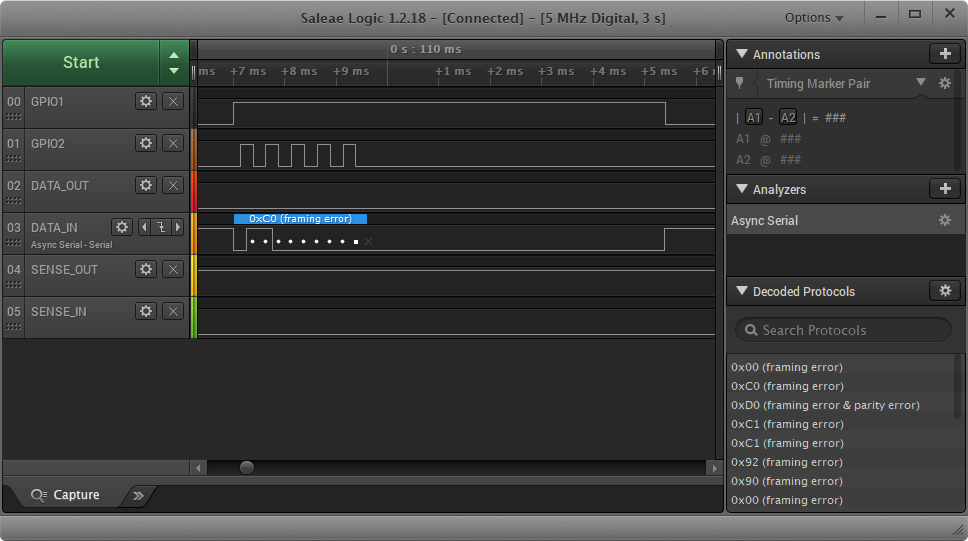
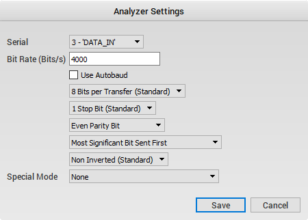

# Developer Documentation

## Hardware

### Test Points

The PT100 PCB has 15 test points, numbered T1 to T15.

NOTE: T1, T2, T4, T5, T6, T7, T8, T9, T10, T11 are referenced to `GND` (T3). T4, T5, T6, T7, T8, T9, T10, T11 are 3.3V level signals.

NOTE: T12, T13, T15 are referenced to `GNDISO` (T14). T12, T13, T15 are 5V level signals.

* T1 - `5V`
    * USB 5V DC power rail
    * Used for MCU USB circuitry and digital isolator power supply

* T2 - `3V3`
    * Regulated 3.3V DC power rail
    * Used for MCU core/ports and EEPROM

* T3 - `GND`
    * Ground for PC connected circuitry (MCU/EEPROM)

* T4 - `SBWTDIO`
    * MCU debug/programming interface, connects to SBW RST on TI LaunchPad ez-FET header

* T5 - `SBWTCK`
    * MCU debug/programming interface, connects to SBW TST on TI LaunchPad ez-FET header

* T6 - `GPIO1`
    * General purpose I/O for debugging, pin P4.4 on MCU, hardware serial port on MCU (TX)
    * Currently outputs a LOW when interrupts are enabled, and outputs a HIGH when interrupts are disabled (during reception of byte during timer operation)

* T7 - `GPIO2`
    * General purpose I/O for debugging, pin P4.5 on MCU, hardware serial port on MCU (RX)
    * Currently toggles state when the `MCU_DATA_IN_3V3` signal is being sampled

* T8 - `MCU_DATA_OUT_3V3`
    * Controls transistor for DATA signal
    * `MCU_DATA_OUT_3V3` LOW = transistor off = DATA line pulled HIGH (`5VISO`) by pull up resistor
    * `MCU_DATA_OUT_3V3` HIGH = transistor on = DATA line pulled LOW (`GNDISO`) by transistor

* T9 - `MCU_DATA_IN_3V3`
    * Level shifted version of `KFD_DATA_IN`

* T10 - `MCU_SENSE_OUT_3V3`
    * Controls transistor for SENSE signal
    * `MCU_SENSE_OUT_3V3` LOW = transistor off = SENSE line pulled HIGH (`5VISO`) by pull up resistor
    * `MCU_SENSE_OUT_3V3` HIGH = transistor on = SENSE line pulled LOW (`GNDISO`) by transistor

* T11 - `MCU_SENSE_IN_3V3`
    * Level shifted version of `KFD_SENSE_IN`

* T12 - `KFD_DATA_IN`
    * Target DATA signal

* T13 - `KFD_SENSE_IN`
    * Target SENSE signal

* T14 - `GNDISO`
    * Target isolated ground

* T15 - `5VISO`
    * Target isolated 5V DC power rail

### External Logic Analyzer

A external logic analyzer can be connected to monitor the TWI signals independent of the KFDtool. The TWI physical protocol is close to a UART signal, and therefore UART protocol decoders of logic analyzers can be used.

There is no stop bit in the TWI protocol, where a stop bit is part of the UART protocol. The logic analyzer reports a framing error where it expects a stop bit, however this can be safely ignored.

The following screenshots are of the Saleae logic analyzer software.

* Ground - connected to T3
* Channel 00 "GPIO1" - connected to T6
* Channel 01 "GPIO2" - connected to T7
* Channel 02 "DATA_OUT" - connected to T8
* Channel 03 "DATA_IN" - connected to T9
* Channel 04 "SENSE_OUT" - connected to T10
* Channel 05 "SENSE_IN" - connected to T11
* Trigger - Channel 03 "DATA_IN" falling edge

Async serial (UART) analyzer settings:

## Firmware

TODO

## Software

TODO
